<div align="center">


# Argus


[](https://go.dev/)
[](LICENSE)
[](https://github.com/priyansh-dimri/argus/pkgs/container/argus-sidecar)
[](https://your-link)

</div>

Argus is a Hybrid AI Web Application Firewall (WAF) written in Go. It aims to solves the trade off between Latency and Context by merging the speed of deterministic pattern matching with the deep contextual understanding of probabilistic AI models.

## Features

- **<6µs latency** - WAF blocks SQLi/XSS/scanners in microseconds
- **Hybrid AI Layer** - Gemini verifies edge cases + business logic flaws
- **3 Modes** - LatencyFirst/SmartShield/Paranoid for any workload
- **Circuit Breaker** - Fail-safe WAF fallback when AI down
- **Go Middleware** - 5 lines to protect any Go app
- **Docker Sidecar** - Zero-code protection (Node, Python, Ruby, etc.)
- **Live Dashboard** - Realtime threat monitoring

## Quick Start

### Option 1: Go SDK (5 Lines of Code)

```bash
go get github.com/priyansh-dimri/argus/pkg/argus
```

```go
package main

import (
    "log"
    "net/http"
    "time"
    "github.com/priyansh-dimri/argus/pkg/argus"
)

func main() {
    // Initialize WAF
    waf, err := argus.NewWAF()
    if err != nil {
        log.Fatal(err)
    }

    // Connect to Argus backend
    client := argus.NewClient(
        "https://argus-5qai.onrender.com/",
        "argus-api-key",
        20*time.Second,
    )

    // Configure security mode
    config := argus.Config{
        Mode: argus.SmartShield,
    }

    // Create and apply middleware
    shield := argus.NewMiddleware(client, waf, config)

    http.Handle("/your-route/", shield.Protect(yourHandler))
    log.Fatal(http.ListenAndServe(":8080", nil))
}
```

---

### Option 2: Docker Sidecar (Any Language)

Protect Node.js, Python, Ruby, or any HTTP service without code changes:

```bash
docker run -d \
  --name argus-sidecar \
  -p 8000:8000 \
  -e TARGET_URL=http://host.docker.internal:3000 \
  -e ARGUS_API_KEY=argus-api-key \
  -e ARGUS_API_URL=https://argus-5qai.onrender.com/ \
  ghcr.io/priyansh-dimri/argus-sidecar:latest
```

**Access your protected application:**

```bash
# Your app runs on: http://localhost:3000/api/users
# Route through Argus: http://localhost:8000/smart-shield/api/users

# Available protection modes:
http://localhost:8000/smart-shield/*   # Recommended: Balanced
http://localhost:8000/latency-first/*  # Maximum speed
http://localhost:8000/paranoid/*       # Maximum security
```

---

## Architecture

### Three Security Modes

| Mode             | WAF                      | AI                   | Latency                     | Use Case                             |
| ---------------- | ------------------------ | -------------------- | --------------------------- | ------------------------------------ |
| **LatencyFirst** | Blocks threats           | Async logging only   | **<5µs**                    | High-traffic APIs, public endpoints  |
| **SmartShield**  | First line               | Verifies WAF blocks  | **<5µs** (99%) / ~50ms (1%) | **Recommended** - Production default |
| **Paranoid**     | Result added in metadata | Checks every request | **~50ms**                   | Payment flows, admin panels          |

### Request Processing Pipeline



### Circuit Breaker Protection

**Configuration:**

```go
// After 3 consecutive failures, breaker opens for 30s
Settings:
  MaxRequests: 1                // Half-open trial requests
  Interval:    60s              // Reset failure counter
  Timeout:     30s              // Open → Half-open transition
  ReadyToTrip: 3 failures
```

**Behavior by Mode:**

| Mode         | Circuit Breaker Open   | Impact                             |
| ------------ | ---------------------- | ---------------------------------- |
| LatencyFirst | Falls back to WAF-only | Zero impact (already async)        |
| SmartShield  | Uses WAF verdict       | Continues blocking obvious threats |
| Paranoid     | Uses WAF verdict       | Continues blocking obvious threats |

### WAF Scope Note

**Coraza (OWASP CRS subset)** blocks SQLi + XSS + scanners + shells + LFI + SSRF + restricted files

---

## Development

### Prerequisites

- Go 1.25.5
- Docker (only for sidecar)
- Make

### Setup

```bash
# Clone repository
git clone https://github.com/priyansh-dimri/argus.git
cd argus

# Install dependencies
go mod download

# Start live development server
make run/live
```

### Running Tests

```bash
# Unit tests
go test ./...

# Race detection testing
go test -race ./...

# Benchmarking tests
go test -bench=. -benchmem ./...
```

---

<div align="center">
Built with ❤️ for developers who care about security AND performance
</div>
